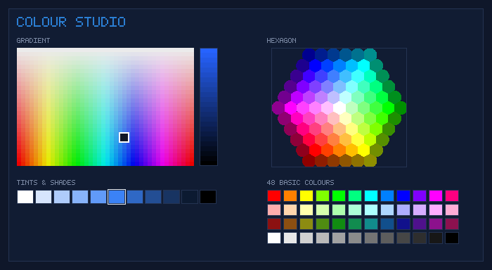

# AutoTyper

A high-fidelity keystroke trace simulator and auto-typer featuring motor kinematics (Fitts' Law ID, hand alternation), cognitive models (Ornstein-Uhlenbeck pace drift, fatigue, log-normal dwells, error episodes), editor auto-indent integration, and an intelligent **Coding Mode** with Pascal `begin`/`end` lookahead.

## Download (no Python required)

1. Open the [latest release](https://github.com/jkjklol308-alt/AutoTyper/releases/latest).
2. Download **`AutoTyper.exe`**.
3. Run it. That's it — the executable is self-contained.

You can also grab the executable from inside the app itself: press **⬇ Get .exe** in the header (or **⬇ Download latest AutoTyper.exe** in ⚙ Settings). The updater always fetches the built executable — never a Python script.

### Running from source instead

```bash
pip install pynput
python auto_typer.py            # launches the interactive UI
python auto_typer.py --check-update
```

## Updating

AutoTyper checks the newest GitHub release once, silently, when the window opens. It stays completely quiet unless a genuinely newer version exists, and it never blocks startup or forces an upgrade.

When an update does exist, the **⬇ Get vX .exe** button appears and you choose what happens:

| How you are running | What updating does |
| --- | --- |
| The packaged **AutoTyper.exe** | Downloads the new build, then offers to install it. On install the app replaces itself, restarts automatically, and keeps your previous build as `AutoTyper.exe.old` in case you want to roll back. |
| From **source** (`python auto_typer.py`) | Downloads the new `AutoTyper.exe` into your Downloads folder and shows you where it went, so you can switch to the packaged build. |

Only files that begin with the Windows `MZ` executable header are ever accepted, so a failed, truncated or HTML-error-page download can never overwrite a working build. The CLI mirrors this:

```bash
python auto_typer.py --check-update            # is there anything newer?
python auto_typer.py --download-exe            # fetch AutoTyper.exe (optionally: --download-exe DIR)
python auto_typer.py --self-update             # download, swap, restart (packaged builds)
```

## Key Features

1. **Stochastic Timing & Kinematic Modeling**
   - **Inter-Key Interval (IKI)**: Gammavariate distributions parameterized by WPM, Fitts' difficulty index, hand alternation, digraph speed-ups, syntax delays, and shift modifier reach penalties.
   - **Dwell Time**: Log-normally distributed key hold durations adapted to current pace and key type.
   - **Pace Drift & Fatigue**: Exact Ornstein-Uhlenbeck discretisation with mean-reversion and workload/recovery dynamics.
   - **Error Episodes**: Naturalistic typing errors (substitution, transposition, omission, insertion, overshoot) with realization pauses and backspace corrections.
   - **Natural Thinking Pauses**: Pauses occur naturally at word boundaries rather than within runs of whitespace.

2. **Editor Auto-Indent Policies**
   - `"off"`: Types text verbatim without deleting indentation.
   - `"copy"`: Automatically predicts and clears indentation copied from the preceding line.
   - `"smart"`: Predicts additional indentation levels opened by block characters (`:`, `{`, `(`, `[`) or Pascal keywords (`begin`, `then`, `do`, `try`, etc.).
   - `"fixed"`: Issues a fixed count of backspaces after each newline.
   - `tab_stop_backspace`: Supports editor behavior where Backspace removes full indentation levels at once (e.g. VS Code smart backspace).

3. **Coding Mode (Pascal / Structured Code Lookahead)**
   - Scans forward to detect matching `begin` ... `end` blocks (with full support for nested blocks, comments, and string literals).
   - Types out the block frame (`begin`, newline, `end`), navigates back up (`<UP>`), fills in all body statements in logical order, and navigates down (`<DOWN>`) past the closing `end`.
   - Produces 100% exact source code in the target editor while capturing authentic coding behavior.

## CLI Usage

### Run Benchmark (Simulated, no keys pressed)
```bash
python auto_typer.py --benchmark --wpm 110 --mode net --typo 3.0 --seed 12345
```

### Benchmark Coding Mode on a Pascal File
```bash
python auto_typer.py --benchmark --coding-mode --file program.pas --indent smart
```

### Export Keystroke Trace to CSV
```bash
python auto_typer.py --benchmark --wpm 100 --seed 42 --csv trace.csv --coding-mode --file program.pas
```

## Running the Test Suite

```bash
python -m unittest test_auto_typer.py test_custom_colours.py test_update_checker.py
```

`test_auto_typer.py` replays planned traces through a virtual editor to prove the emitted keystrokes reproduce the source text exactly, `test_update_checker.py` covers the release lookup, the download/verification path and the self-update swap, `test_custom_colours.py` exercises the palette bookkeeping through a miniature `tkinter` stub, and `test_guide_ui.py` covers the colour studio, the guide and the tidied main window — so the whole suite runs with no display.

## The in-app guide

Press **❓ Guide** in the header, hit **F1**, or just launch AutoTyper for the first time — the guide opens automatically once and explains every control in the app, from *Target speed* to the colour studio.

- Around 70 topics across sections such as **Typing settings**, **Source text panel**, **Running a job**, **Settings window**, **The colour studio**, **Keyboard shortcuts** and **Troubleshooting**.
- **Search box** at the top: type `wpm`, `typo`, `palette`, `stop`… and only the matching topics stay on screen, with a live “showing X of Y topics” count.
- Nothing is hidden behind a manual: any control added to the window is expected to appear in the guide, and `test_guide_ui.py` fails if the documentation list is left behind.

## Custom UI Colours



Appearance settings live in ⚙ Settings. Press **🎨 New colours…** to open the **colour studio**: three pickers for the same colour, a role selector, a live preview and a name.

| Tab | What it gives you |
| --- | --- |
| **Gradient** | The Microsoft-Paint “Define Custom Colors” square — hue left to right, saturation top to bottom — plus a **brightness bar** down its right-hand side, so the full colour range (not just a fixed set of swatches) is one click away. Click and drag; the crosshair marks where you are. |
| **Swatches** | Paint’s **48 basic colours** in four rows of twelve: the full-saturation hues, their pastel tints, their deep shades, and the white-to-black neutral ramp. |
| **Hexagon** | The honeycomb of discrete shades (white centre, tints fanning out by hue, dark shades on the rim) with a black-to-white hexagon strip underneath. |

Underneath every tab sits the **Tints & shades** ramp: eleven steps of the colour being edited, from pastel tints through the pure colour to deep shades and black. One click applies a lighter or darker version of exactly the same hue — no hunting around the square.

- Choose whether the next colour fills **Primary** (headings, buttons), **Accent** (highlights, progress, selections) or **Background** (window, panels, text area). Readable foregrounds are derived automatically, so text never ends up invisible.
- Type any hex (`#RGB`, `#RRGGBB`, with or without the `#`) into the **Hex** box and press **Use hex**; the **RGB readout** shows the channels you are editing.
- Watch the **live preview**, name the set and press **Save colours**. Saved palettes appear in the palette grid marked with a ★, are applied instantly, survive restarts (stored in `~/.autotyper_settings.json`; settings from earlier releases under the old file name are picked up automatically), and can be re-opened for editing by double-clicking a card or pressing **Edit selected**. **Delete selected** removes one; built-in palettes cannot be deleted. Up to 16 custom palettes are kept.

## A tidier window

The main window is grouped into three cards — **Typing speed**, **Editor behaviour** and **Text to type** — with the run controls in the footer:

- a character/line counter next to the text toolbar, so you can see exactly how much text is loaded;
- hover help on the controls that need it, and a footer reminder of the shortcuts;
- **Ctrl+Enter** starts a job, **Esc** stops it, **F1** opens the guide and **Ctrl+A** selects the source text;
- one shared palette registry paints the whole interface (and any open settings, guide or colour-studio window) the moment you switch palette.

## Building the executable yourself

```bash
pip install pyinstaller pynput
pyinstaller AutoTyper.spec --noconfirm     # -> dist/AutoTyper.exe
```

Pushing a tag that matches `APP_VERSION` (for example `v1.1.0`) makes GitHub Actions run the tests, build the executable and attach it to a release automatically — see `.github/workflows/release.yml`.
