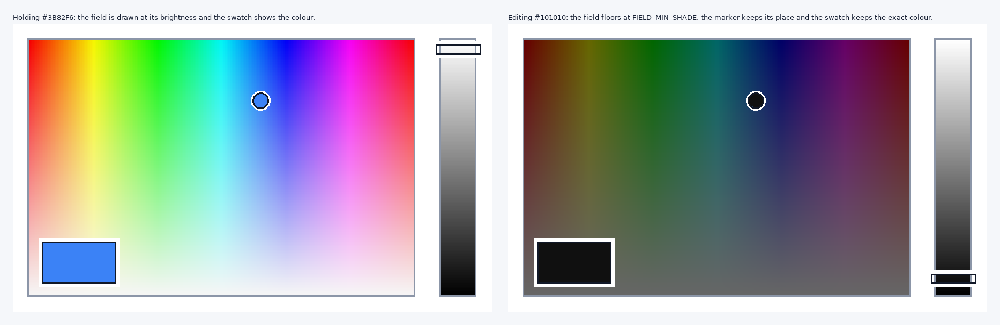

# AutoTyper

A high-fidelity keystroke trace simulator and auto-typer featuring motor kinematics (Fitts' Law ID, hand alternation), cognitive models (Ornstein-Uhlenbeck pace drift, fatigue, log-normal dwells, error episodes), editor auto-indent integration, and an intelligent **Coding Mode** with Pascal `begin`/`end` lookahead.

## Download (no Python required)

1. Open the [latest release](https://github.com/jkjklol308-alt/AutoTyper/releases/latest).
2. Download **`AutoTyper.exe`**.
3. Run it. That's it — the executable is self-contained.

You can also grab the executable from inside the app itself: open **⚙ Settings** and press **⬇ Download latest AutoTyper.exe** under *Updates & downloads*. The updater always fetches the built executable — never a Python script.

### Running from source instead

```bash
pip install pynput
python auto_typer.py            # launches the interactive UI
python auto_typer.py --check-update
```

## Updating

AutoTyper checks the newest GitHub release once, silently, when the window opens. It stays completely quiet unless a genuinely newer version exists, and it never blocks startup or forces an upgrade.

When an update does exist, the status bar names the new version, AutoTyper asks once whether to download it, and the download button in ⚙ Settings is relabelled **⬇ Get vX .exe**. You always choose what happens:

### If you see "Error loading Python DLL" right after an update

That message means the new build was started with the path of the *previous*
build's unpacked temporary folder — a folder that had already been deleted —
so it could not find `python312.dll` inside it. Versions **v1.1.0 and v1.1.1**
did exactly that, every time an update restarted the app.

The fix (v1.1.2 and later) has to be *running* before it can help, and here it
never gets that far: the build that performs an update is the one that decides
how the next build is started. So do this once, by hand:

1. Open the [latest release](https://github.com/jkjklol308-alt/AutoTyper/releases/latest).
2. Download **`AutoTyper.exe`**.
3. Replace your existing AutoTyper.exe with it — the one your shortcut opens, so
   check the shortcut's *Target* if you have several copies lying around. (If a
   leftover `AutoTyper.exe.old` from an older version is removed the next time
   the app starts.)
4. Start it, and check **⚙ Settings**: the hint under *Updates & downloads*
   names the version you are running.

From v1.1.2 on, updating restarts the app with the same clean environment a
double-click gives it; from **v1.1.3** the restart is verified and, if the new
build never comes up, rolled back; and from **v1.1.4** the spare copy that makes
the rollback possible is deleted again as soon as the new build reports its
window:

| How you are running | What updating does |
| --- | --- |
| The packaged **AutoTyper.exe** | Downloads the new build, then offers to install it. On install the app replaces itself, restarts automatically, and starts the new build. The swap script waits for the new build to report that its window is up; if it never does, the previous build is put back and started again, and both logs explain what happened. Your previous build is kept as `AutoTyper.exe.old` only for as long as that swap needs it - it is deleted again the moment the new build reports its window, so a successful update leaves nothing extra beside the program. |
| From **source** (`python auto_typer.py`) | Downloads the new `AutoTyper.exe` into your Downloads folder and shows you where it went, so you can switch to the packaged build. |

Only files that begin with the Windows `MZ` executable header are ever accepted, and a download must match the size the release advertises for it, so a failed, truncated or HTML-error-page download can never overwrite a working build.

Updates leave a record. **⚙ Settings → Open update log** shows the log the app and the swap script write (`%LOCALAPPDATA%\AutoTyper`, or `~/.autotyper` outside Windows): the version and environment each build started with, every step of the download and the swap, and the verdict — `ok vX` or `rolled-back vX <why>`. If an update ever fails, that log is the whole story:

```text
[2026-10-08 13:18:18] v1.1.3 update: staging v1.1.4 over C:\Apps\AutoTyper.exe (new build: ..., 12100039 bytes)
[2026-10-08 13:18:21] v1.1.4 start: frozen=True ... onefile-home=... (own extraction dir) ...
[2026-10-08 13:18:22] v1.1.4 started and signalled that its window is up.
```

The CLI mirrors this:

```bash
python auto_typer.py --check-update            # is there anything newer?
python auto_typer.py --download-exe            # fetch AutoTyper.exe (optionally: --download-exe DIR)
python auto_typer.py --self-update             # download, swap, restart (packaged builds)
```

## Key Features

1. **Stochastic Timing & Kinematic Modeling**
   - **Inter-Key Interval (IKI)**: Gammavariate distributions parameterized by WPM, Fitts' difficulty index, hand alternation, digraph speed-ups, syntax delays, and shift modifier reach penalties.
   - **Dwell Time**: Log-normally distributed key hold durations adapted to current pace and key type.
   - **Pace Drift & Fatigue**: Exact Ornstein-Uhlenbeck discretisation with mean-reversion and workload/recovery dynamics.
   - **Error Episodes**: Naturalistic typing errors (substitution, transposition, omission, insertion, overshoot) with realization pauses and backspace corrections.
   - **Natural Thinking Pauses**: Pauses occur naturally at word boundaries rather than within runs of whitespace.

2. **Editor Auto-Indent Policies**
   - `"off"`: Types text verbatim without deleting indentation.
   - `"copy"`: Automatically predicts and clears indentation copied from the preceding line.
   - `"smart"`: Predicts additional indentation levels opened by block characters (`:`, `{`, `(`, `[`) or Pascal keywords (`begin`, `then`, `do`, `try`, etc.).
   - `"fixed"`: Issues a fixed count of backspaces after each newline.
   - `tab_stop_backspace`: Supports editor behavior where Backspace removes full indentation levels at once (e.g. VS Code smart backspace).

3. **Coding Mode (Pascal / Structured Code Lookahead)**
   - Scans forward to detect matching `begin` ... `end` blocks (with full support for nested blocks, comments, and string literals).
   - Types out the block frame (`begin`, newline, `end`), navigates back up (`<UP>`), fills in all body statements in logical order, and navigates down (`<DOWN>`) past the closing `end`.
   - Produces 100% exact source code in the target editor while capturing authentic coding behavior.

## CLI Usage

### Run Benchmark (Simulated, no keys pressed)
```bash
python auto_typer.py --benchmark --wpm 110 --mode net --typo 3.0 --seed 12345
```

### Benchmark Coding Mode on a Pascal File
```bash
python auto_typer.py --benchmark --coding-mode --file program.pas --indent smart
```

### Export Keystroke Trace to CSV
```bash
python auto_typer.py --benchmark --wpm 100 --seed 42 --csv trace.csv --coding-mode --file program.pas
```

## Running the Test Suite

```bash
python -m unittest test_auto_typer.py test_custom_colours.py test_update_checker.py
```

`test_auto_typer.py` replays planned traces through a virtual editor to prove the emitted keystrokes reproduce the source text exactly, `test_update_checker.py` covers the release lookup, the download/verification path and the self-update swap, and `test_custom_colours.py` exercises the colour picker through a miniature `tkinter` stub so the suite runs with no display.

## Custom UI Colours



Both panels above are drawn from the app's own colour maths: while you hold a colour the field is painted at its brightness, the current colour is shown as a swatch in the field's bottom-left corner and by the filled dot inside the marker, and when you edit a near-black colour the field stops darkening at `FIELD_MIN_SHADE` (0.4) so it stays a readable rainbow instead of turning into a black box — the swatch and the hex box still show the exact colour.

The header keeps a single **⚙ Settings** button — palettes, window behaviour and updates all live inside it:

- **Custom “UI colour” section**: press **🎨 New colours…** to open the editor, which uses the *Microsoft Paint “Edit colours” style gradient picker* — a big colour field (the whole rainbow left to right, pure colours fading to greyscale towards the bottom, drawn at the current shade) beside a white‑to‑black shade strip. Click or **drag** anywhere in the field to pick the colour itself — the colour you have chosen is always the pixel under the marker — then slide the strip to lighten or darken it; every intermediate colour is reachable, not just a fixed set of swatches.
- Choose a **Primary**, **Accent** and **Background** colour (drag in the gradient or type `#RRGGBB`), watch the live preview, give the set a name, and **Save colours**.
- Saved palettes appear in the palette grid marked with a ★, are applied instantly, survive restarts (stored in `~/.autotyper_settings.json`; settings from earlier releases under the old file name are picked up automatically), and can be re-opened for editing by double-clicking a card or pressing **Edit selected**. **Delete selected** removes one; built-in palettes cannot be deleted. Up to 16 custom palettes are kept.

## Version numbering

AutoTyper versions use the format `MAJOR.MINOR.PATCH` (for example, `1.1.2`):

- **First number (`MAJOR`)**: changes to the app's logic.
- **Second number (`MINOR`)**: other changes.
- **Third number (`PATCH`)**: bug fixes.

When either the first or second number is increased, reset the bug-fix number to `0`. For example, a bug-fix release could go from `1.1.2` to `1.1.3`, while an increase to the second number would go from `1.1.2` to `1.2.0`.

## Building the executable yourself

```bash
pip install pyinstaller pynput
pyinstaller AutoTyper.spec --noconfirm     # -> dist/AutoTyper.exe
```

Pushing a tag that matches `APP_VERSION` (for example `v1.1.1`) makes GitHub Actions run the tests, build the executable and attach it to a release automatically — see `.github/workflows/release.yml`. Update `APP_VERSION` in `auto_typer.py` and use the matching `v...` tag when publishing a release.
